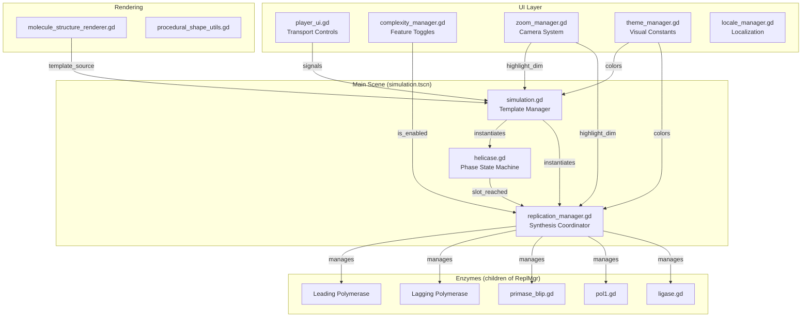
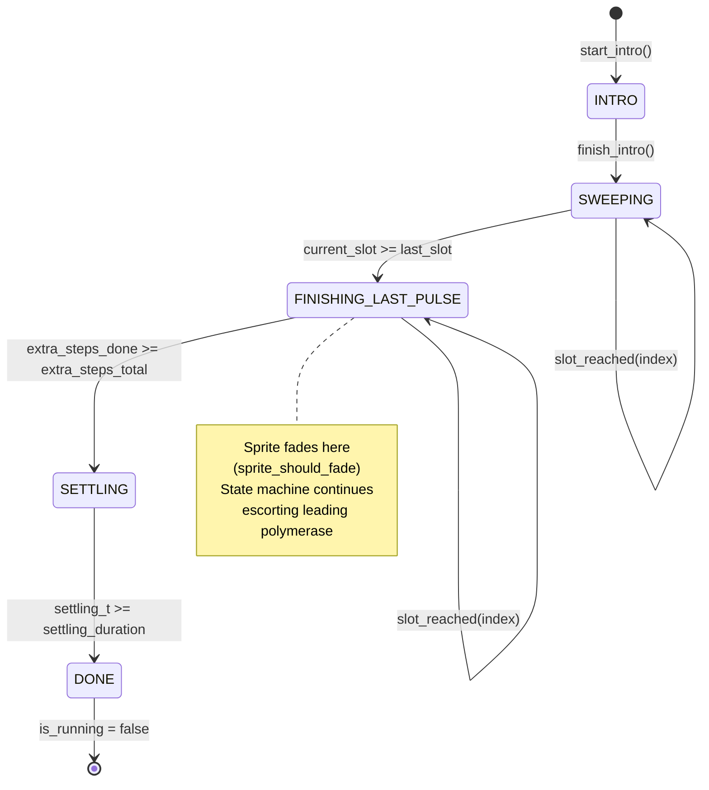
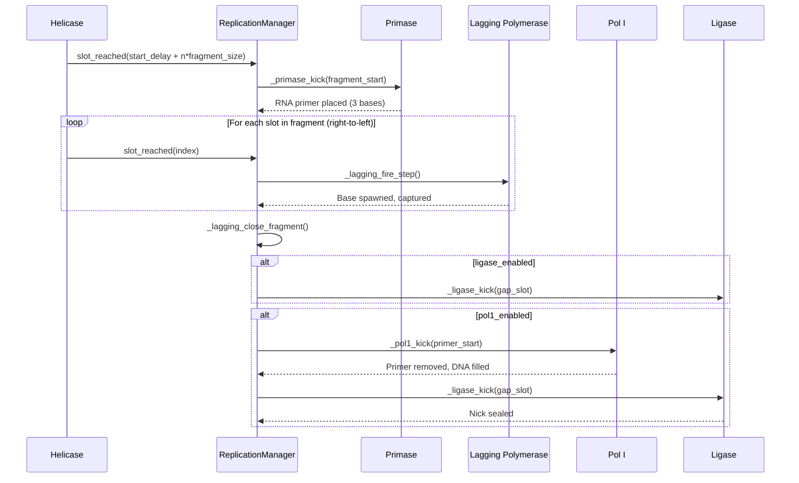
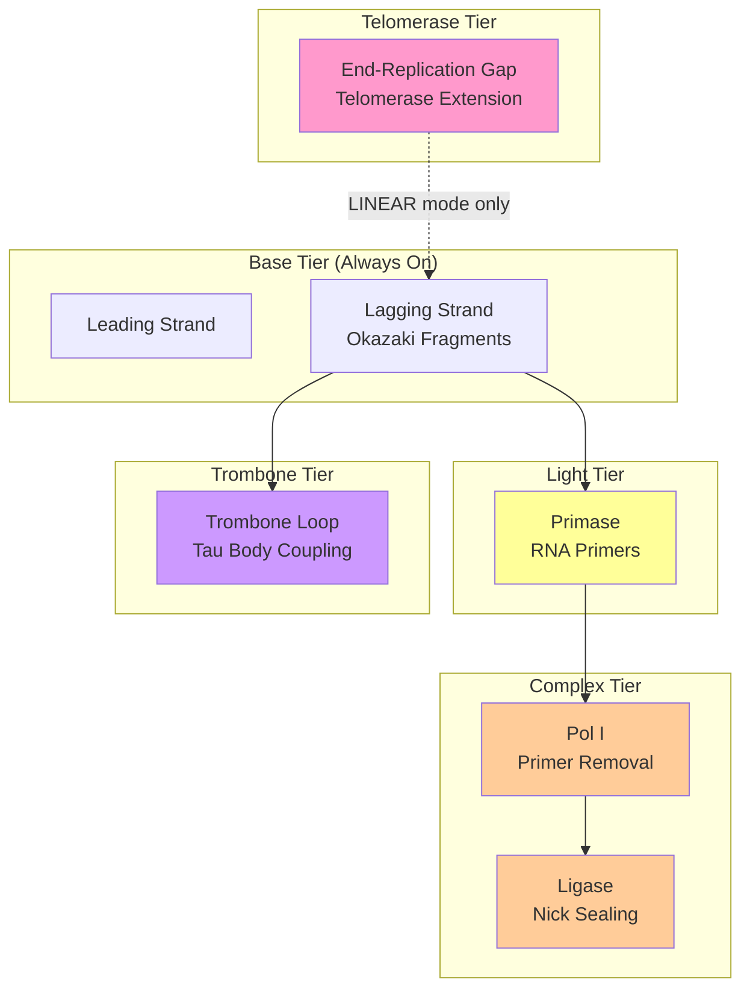
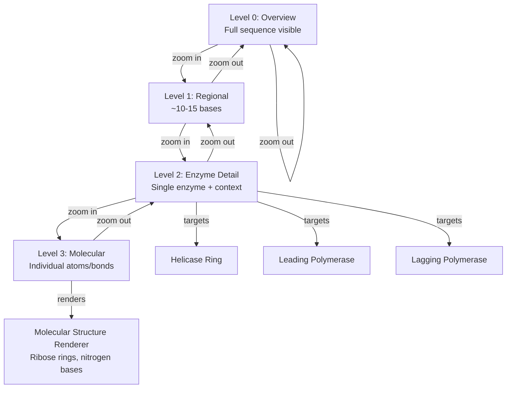
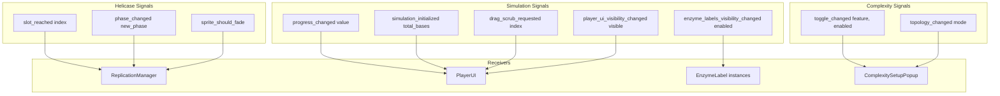

# Zymulador Wiki — Comprehensive Architecture Guide

**Last Updated**: Based on codebase v85 (August 2026)  
**Companion Documents**: This wiki summarizes *implemented* architecture. For full design rationale, planned features, and biological model, see:
- [`docs/architecture/DESIGN.md`](architecture/DESIGN.md) — Stable philosophy and biological model
- [`docs/architecture/STATUS.md`](architecture/STATUS.md) — Current implementation state, roadmap, known issues
- [`docs/architecture/COMPLEXITY_MODEL.md`](architecture/COMPLEXITY_MODEL.md) — Complexity toggle system, chimera model, topology gating
- [`docs/architecture/TODO.md`](architecture/TODO.md) — Working list of bugs and features
- Enzyme-specific designs in `docs/enzymes/` (HelicaseDesign.md, TusTerDesign.md, TelomeraseDesign.md, etc.)

---

## ⚠️ Implemented vs. Planned Features

**This wiki distinguishes between what is built now vs. what is designed but not yet implemented.** Many features documented in `/docs` are *planned* but not yet coded. See [Feature Status Matrix](#feature-status-matrix) for details.

---

## Table of Contents

1. [Overview](#overview)
2. [Feature Status Matrix](#feature-status-matrix)
3. [Project Structure](#project-structure)
4. [Core Architecture](#core-architecture)
5. [Script Reference](#script-reference)
6. [Data Flow & Relationships](#data-flow--relationships)
7. [Flowcharts](#flowcharts)
8. [Key Parameters & Configuration](#key-parameters--configuration)
9. [Signal Communication](#signal-communication)

---

## Overview

**Zymulador** is a molecular biology education platform built in Godot 4.x (GDScript). It simulates DNA replication as Phase 1 of a broader central dogma simulation (**DNA replication → Transcription → Translation**). The core design principle is **modular complexity** — a single simulator where educators set the complexity level to match their audience.

### Key Implemented Features
- ✅ DNA replication simulation with leading/lagging strand synthesis
- ✅ Okazaki fragment maturation (primase → Pol I → ligase relay)
- ✅ Interactive playback controls with drag-to-scrub timeline
- ✅ Multi-language support (English, Spanish, Portuguese-Brazil)
- ✅ Complexity toggles (primase, Pol I, ligase, topology mode)
- ✅ Procedural enzyme visuals (helicase ring, polymerase clamp/halo, primase blip, Pol I, ligase)
- ✅ End-replication problem (telomere gap) in linear mode

### Key Planned Features (NOT YET IMPLEMENTED)
- ❌ Trombone loop model (lagging polymerase coupled to replisome) — *designed in TromboneLoopDesign.md*
- ❌ Full replisome (clamp loader, β-clamps as distinct enzymes) — *partial: clamp visuals exist but not as separate toggles*
- ❌ Telomerase enzyme visual (extends template strand) — *designed in TelomeraseDesign.md*
- ❌ SSB/shelterin (single-strand binding proteins) — *designed in COMPLEXITY_MODEL.md*
- ❌ Tus-Ter termination (circular mode fork trap) — *designed in TusTerDesign.md*
- ❌ Topoisomerase (torsional strain relief ahead of fork) — *designed in Topoisomerase.md*
- ❌ Bidirectional replication (two replisomes from single origin) — *sketched in TusTerDesign.md*
- ❌ Transcription and Translation phases — *mentioned in DESIGN.md as future scope*

See [Feature Status Matrix](#feature-status-matrix) and [`docs/architecture/STATUS.md`](architecture/STATUS.md) for detailed implementation status.

---

## Feature Status Matrix

| Feature | Status | Complexity Tier | Design Doc | Notes |
|---------|--------|-----------------|------------|-------|
| **Leading strand synthesis** | ✅ Implemented | Base | — | Continuous 5'→3' synthesis, helicase-anchored positioning |
| **Lagging strand synthesis (base)** | ✅ Implemented | Base | OkazakiMaturationDesign.md | Independent polymerase, fixed-size tiles, right-to-left firing |
| **Helicase visual (ring)** | ✅ Implemented | Base | HelicaseDesign.md | Procedural octagon subunits, rotation animation |
| **Polymerase visual (clamp/halo)** | ✅ Implemented | Base | — | Clamp: octagon primitive; Halo: traveling particle |
| **Primase (blip)** | ✅ Implemented | Light | OkazakiMaturationDesign.md | Transient blip at fragment start, RNA primer persistence |
| **Ligase (traveling enzyme)** | ✅ Implemented | Light/Complex | OkazakiMaturationDesign.md | Seals nicks between fragments; Light: gated by Pol III completion; Complex: gated by Pol I completion |
| **Pol I (nick translation)** | ✅ Implemented | Complex | OkazakiMaturationDesign.md | Removes RNA primers, fills DNA behind |
| **Topology mode (CIRCULAR/LINEAR)** | ✅ Implemented | Mode-gate | COMPLEXITY_MODEL.md | Gates end-game modules (telomere gap vs. future Tus-Ter) |
| **Telomere gap (end-replication problem)** | ✅ Implemented | Linear-only | TelomeraseDesign.md | Shows consequence (gap), not yet the actor (telomerase enzyme) |
| **Trombone loop model** | ❌ Planned | High | TromboneLoopDesign.md | Lagging polymerase coupled to replisome via τ body |
| **Full replisome (clamp loader, β-clamps)** | ⚠️ Partial | High | COMPLEXITY_MODEL.md | Clamp visuals exist but not as separate toggles |
| **Telomerase enzyme visual** | ❌ Planned | Eukaryotic-only | TelomeraseDesign.md | Extends template strand, requires dynamic sequence growth |
| **SSB/shelterin** | ❌ Planned | Stage 2 elongation | COMPLEXITY_MODEL.md | Coats ssDNA behind helicase |
| **Tus-Ter termination** | ❌ Planned | Circular-only | TusTerDesign.md | Fork trap for circular chromosomes |
| **Topoisomerase** | ❌ Planned | Advanced | Topoisomerase.md | Relieves torsional strain ahead of fork |
| **Bidirectional replication** | ❌ Planned | Circular | TusTerDesign.md | Two replisomes from single origin |
| **Transcription phase** | ❌ Future scope | — | DESIGN.md | Post-replication central dogma phase |
| **Translation phase** | ❌ Future scope | — | DESIGN.md | Final central dogma phase |

**Legend**: ✅ Implemented | ⚠️ Partial | ❌ Not yet implemented

---

## Project Structure

```
Zymulador/
├── scenes/                     # Godot scene files (.tscn)
│   ├── simulation.tscn         # Main simulation scene
│   ├── PlayerUI.tscn           # Horizontal playback controls
│   ├── VerticalPlayerUI.tscn   # Vertical playback controls
│   ├── ComplexitySetupPopup.tscn
│   ├── SequenceLoaderPopup.tscn
│   └── enzyme_label.tscn
├── scripts/
│   ├── simulation.gd           # Main coordinator (template manager)
│   ├── core/                   # Core systems
│   │   ├── nitrogen_base.gd
│   │   ├── ribose_deriver.gd
│   │   ├── molecule_fold_engine.gd
│   │   ├── molecule_topology.gd
│   │   └── reaction_operator.gd
│   ├── replication/            # Enzyme logic
│   │   ├── helicase.gd
│   │   ├── helicase_ring.gd
│   │   ├── helicase_atp_cycle.gd
│   │   ├── replication_manager.gd
│   │   ├── polymerase_clamp.gd
│   │   ├── polymerase_halo.gd
│   │   ├── polymerase_shape.gd
│   │   ├── primase_blip.gd
│   │   ├── pol1.gd
│   │   ├── ligase.gd
│   │   ├── ligase_cofactor.gd
│   │   └── dna_sequence_resource.gd
│   ├── ui/                     # UI controllers
│   │   ├── player_ui.gd
│   │   ├── complexity_manager.gd
│   │   ├── complexity_setup_popup.gd
│   │   ├── sequence_loader_popup.gd
│   │   ├── zoom_manager.gd
│   │   ├── camera_regent.gd
│   │   ├── theme_manager.gd
│   │   ├── locale_manager.gd
│   │   └── cursor_affordance_manager.gd
│   └── rendering/              # Visual rendering
│       ├── molecule_structure_renderer.gd
│       ├── procedural_shape_utils.gd
│       └── pair_capsule_overlay.gd
├── docs/                       # Documentation
├── localization/               # Translation files
└── resources/                  # Shared resources
```

---

## Core Architecture

### Architectural Principles

1. **Modular Complexity**: Every feature is toggle-aware from the start
2. **Single Source of Truth**: Each property has exactly one writer
3. **Manager Pattern**: Subsystems are encapsulated in manager nodes
4. **Event-Driven**: Signals coordinate cross-script communication
5. **Helicase-Anchored Positioning**: Replisome positioning derives from helicase state

### Manager Hierarchy

```
simulation.gd (Root Coordinator)
├── helicase_mgr (helicase.gd)
├── replication_mgr (replication_manager.gd)
│   ├── leading_polymerase
│   ├── lagging_polymerase
│   ├── leading_clamp / lagging_clamp
│   ├── primase_blip
│   ├── pol1
│   └── ligase
├── %ZoomManager (zoom_manager.gd)
├── %ThemeManager (theme_manager.gd)
├── %LocaleManager (locale_manager.gd)
├── %ComplexityManager (complexity_manager.gd)
└── %CursorAffordanceManager (cursor_affordance_manager.gd)
```

---

## Script Reference

### Core Scripts

#### `simulation.gd` — Main Coordinator
**Purpose**: Template manager and visual coordinator. Owns template strand geometry, wobble animation, and zoom highlighting.

**Key Variables**:
- `dna_sequence`: DnaSequenceResource — current DNA sequence
- `helicase_mgr`: Helicase instance
- `replication_mgr`: ReplicationManager instance
- `num_nucleotide_slots`: Total slots in simulation
- `okazaki_fragment_size`: Slots per Okazaki fragment
- `lagging_gap_enabled`: Show end-replication problem gap
- `ligase_enabled`: Show nicks between fragments

**Key Functions**:
- `initialize_simulation(sequence_string)`: Set up simulation with DNA sequence
- `teardown_simulation()`: Clean up all dynamic nodes
- `_process(delta)`: Update wobble, zoom highlights
- `set_player_ui_visible(visible)`: Toggle UI panel
- `set_enzyme_labels_enabled(enabled)`: Toggle enzyme labels

**Signals**:
- `progress_changed(new_progress)`: Simulation progress (0.0-1.0)
- `simulation_initialized(total_bases)`: Ready after initialization
- `drag_scrub_requested(index)`: User dragging timeline
- `player_ui_visibility_changed(visible)`: UI panel toggled
- `enzyme_labels_visibility_changed(enabled)`: Labels toggled

---

#### `helicase.gd` — Replication Fork Engine
**Purpose**: Owns replication phase state machine and slot-by-slot stepping logic.

**Key Variables**:
- `current_slot_index`: Current position (0 to num_slots-1)
- `step_t`: Progress through current inter-slot step (0.0-1.0)
- `phase`: INTRO, SWEEPING, FINISHING_LAST_PULSE, SETTLING, DONE
- `speed_multiplier`: Playback speed (1x, 2x, 4x, 8x)
- `base_step_duration`: Seconds per slot at 1x speed

**Key Functions**:
- `initialize(slot_count, settling_duration)`: Setup
- `_process(delta)`: State machine stepping
- `start_intro()`, `finish_intro()`: Animation control
- `pause()`, `resume()`: Playback control
- `start_finishing(remaining_leading_slots)`: Escort walk setup

**Signals**:
- `slot_reached(index)`: Fired when helicase arrives at new slot
- `phase_changed(new_phase)`: Fired on phase transitions
- `sprite_should_fade`: Fired at SWEEPING→FINISHING_LAST_PULSE

---

#### `replication_manager.gd` — Synthesis Coordinator
**Purpose**: Owns all synthesis state, spawning, rendering, and enzyme animation for both strands.

**Key Variables**:
- `leading_synthesized_bases[]`: Bases synthesized on leading strand
- `lagging_fragments[]`: Completed Okazaki fragments
- `lagging_current_fragment`: Fragment in progress
- `leading_polymerase`, `lagging_polymerase`: Visual nodes
- `primase_blip`, `pol1`, `ligase`: Enzyme instances
- `leading_faded`, `lagging_polymerase_faded`, `pol1_faded`, `ligase_faded`: Fade states

**Key Functions**:
- `initialize(sim_node, tm, zoom_mgr)`: Setup with parent references
- `reset()`: Clear synthesis state (keep enzymes)
- `update(delta, ctx)`: Per-frame update
- `render(ctx)`: Render synthesis visuals
- `scrub_rebuild(ctx)`: Rebuild state for scrub position
- `connect_helicase(helicase_mgr)`: Wire helicase signals

**Leading Strand Section** (`_leading_*`):
- `_leading_reset()`: Clear leading arrays
- `_leading_fire_step(slot)`: Spawn base at slot
- `_leading_render()`: Draw backbone line

**Lagging Strand Section** (`_lagging_*`):
- `_lagging_reset()`: Clear fragments array
- `_lagging_fire_step()`: Fire next slot in current fragment
- `_lagging_start_catchup()`: Post-helicase completion
- `_lagging_render()`: Draw fragment backbones

**Capture Section** (`_capture_*`):
- `_capture_on_leading_slot_reached(slot)`: Event-driven spawn trigger
- `_capture_begin_lagging(slot)`: Start capture animation
- `_capture_finish_lagging(slot)`: Complete base placement

---

### UI Scripts

#### `player_ui.gd` — Transport Controls
**Purpose**: Playback controls (play/pause, step, scrub, speed).

**Key Variables**:
- `simulation`: Parent simulation node
- `zoom_mgr`: Camera2D reference
- `_is_dragging`: Scrubber drag state
- `_hover_index`: Sequence label hover position

**Key Functions**:
- `_ready()`: Connect signals, initialize speed ladder
- `_input(event)`: Keyboard shortcuts (Space, ., ,, F2, F3)
- `_on_play_pause_pressed()`: Toggle playback
- `_on_scrubber_value_changed(value)`: Scrub to position
- `set_speed(multiplier)`: Apply speed to helicase

---

#### `complexity_manager.gd` — Feature Toggles
**Purpose**: Owns feature toggles with cascade logic. Implements three cascade patterns: parent/child (Pol I enables primase+ligase), bridge-toggle (primase/ligase independently enable their own pieces when Pol I is off), and mode-gate (topology gates end-game modules).

**Key Variables**:
- `topology_mode`: CIRCULAR or LINEAR (mode-gate, gates Tus-Ter vs. telomere gap)
- `primase_enabled`, `pol1_enabled`, `ligase_enabled`: Okazaki maturation tiers
- `trombone_loop_enabled`: Replisome coupling tier (NOT YET IMPLEMENTED — planned in TromboneLoopDesign.md)
- `cofactor_activation_enabled`: ATP/NAD+ visualization lens
- `ssb_enabled`: SSB/shelterin toggle (NOT YET IMPLEMENTED — planned in COMPLEXITY_MODEL.md)

**Key Functions**:
- `is_enabled(feature_name)`: Check if feature is active
- `set_primase_enabled(value)`: Toggle with Pol I cascade
- `set_ligase_enabled(value)`: Toggle with Pol I cascade
- `set_pol1_enabled(value)`: Bridge toggle (enables primase+ligase)
- `set_topology_mode(value)`: Switch CIRCULAR/LINEAR, triggers `topology_changed` signal
- `ligase_uses_nad()`: Bacterial vs eukaryotic mode (NAD+ for bacterial ligase, ATP for eukaryotic)

**Signals**:
- `toggle_changed(feature, enabled)`: Any toggle changed
- `topology_changed(mode)`: Topology switched (gates which end-game modules are coherent)

**Cascade Patterns** (see [Complexity Cascade Flowchart](#5-complexity-toggle-dependencies)):
1. **Parent/Child**: Pol I → Primase + Ligase (enabling Pol I auto-enables both)
2. **Bridge-toggle**: Primase or Ligase can be enabled independently when Pol I is OFF (Light tier)
3. **Mode-gate**: Topology (CIRCULAR/LINEAR) gates mutually-exclusive end-game modules (Tus-Ter vs. telomere gap)

---

#### `zoom_manager.gd` — Camera System
**Purpose**: Manages camera zoom levels, highlight/dim system, and vertical mode.

**Key Variables**:
- `vertical_mode`: Portrait layout for mobile/recording
- `current_zoom_level`: 0 (overview), 1, 2, 3 (deep zoom)
- `highlighted_target`: Currently focused enzyme/strand

**Key Functions**:
- `register_target(name, frame_providers, label_key, visible_check)`: Register zoom target
- `zoom_in()`, `zoom_out()`: Navigate zoom levels
- `get_enzyme_highlight_dim(target)`: Get dim factor for enzyme
- `get_strand_highlight_dim()`: Get dim factor for strands
- `get_along_extent()`, `get_cross_extent()`: Viewport dimensions

---

### Rendering Scripts

#### `molecule_structure_renderer.gd` — Deep Zoom Renderer
**Purpose**: Skeletal ribose/nitrogen base renderer for deep zoom levels.

**Key Variables**:
- `template_source`: simulation.gd reference
- `active_beads[]`: Currently rendered atoms

**Key Functions**:
- `set_template_source(source)`: Wire to simulation
- `_process(delta)`: Per-frame atom rendering
- `is_slot_active(slot)`: Check if slot has molecular detail

---

#### `procedural_shape_utils.gd` — Shape Generation
**Purpose**: Shared utilities for procedural blob/shape generation.

**Key Functions**:
- `create_procedural_blob(points, resolution, amplitude)`: Generate organic shapes
- `create_helix_axis(points, radius, pitch)`: Generate helix path

---

### Core Molecular Scripts

#### `nitrogen_base.gd` — Base Geometry
**Purpose**: Nitrogen base (A, T, C, G) scene controller.

**Key Variables**:
- `base_type`: "A", "T", "C", or "G"
- `complement`: Complementary base type
- `hydrogen_bonds`: Number of bonds (2 for A-T, 3 for C-G)

---

#### `ribose_deriver.gd` — Sugar Ring Generator
**Purpose**: Compute ribose/deoxyribose ring geometry.

**Key Functions**:
- `derive_ring_positions(base_position, orientation)`: Calculate ring vertices
- `get_phosphate_attachment_point()`: Where phosphate connects

---

## Data Flow & Relationships

### Initialization Flow

```
User opens simulation
    ↓
ComplexitySetupPopup.show_dialog(true)
    ↓
User confirms complexity settings
    ↓
_on_startup_complexity_confirmed()
    ↓
SequenceLoaderPopup.show_dialog(true)
    ↓
User selects/enters sequence
    ↓
sequence_loaded signal fires
    ↓
simulation.initialize_simulation(dna_sequence_string)
    ↓
1. teardown_simulation() — clean old state
2. dna_sequence.from_string(seq) — parse sequence
3. _setup_template_strand() — create PathFollow2D slots
4. _setup_helicase() — instantiate helicase_mgr
5. _setup_replication_manager() — instantiate replication_mgr
6. replication_mgr.connect_helicase(helicase_mgr)
7. emit simulation_initialized
    ↓
PlayerUI._on_simulation_initialized()
    ↓
Scrubber.max_value = get_max_scrub_index()
Playback ready
```

### Playback Loop

```
_user presses Play_
    ↓
player_ui._on_play_pause_pressed()
    ↓
helicase_mgr.resume()
replication_mgr.manual_override = false
    ↓
_PROCESS LOOP (every frame):
    ↓
helicase_mgr._process(delta):
    - step_t += delta / step_duration
    - if step_t >= 1.0: current_slot_index++, emit slot_reached
    ↓
simulation._process(delta):
    - helicase_x = lerp(prev_x, curr_x, step_t)
    - polymerase_x = helicase_x - offset
    - apply_zoom_highlight()
    ↓
replication_mgr.update(delta, ctx):
    - _leading_update(): check proximity, fire bases
    - _lagging_update(): check fragment timing, fire slots
    - _primase_update(): place RNA primers
    - _pol1_update(): remove primers, fill DNA
    - _ligase_update(): seal nicks
    ↓
replication_mgr.render(ctx):
    - _leading_render(): draw backbone line
    - _lagging_render(): draw fragment backbones
    ↓
Visual update complete
```

### Scrubbing Flow

```
_user drags scrubber_
    ↓
player_ui._on_scrubber_value_changed(value)
    ↓
simulation.manual_override = true
helicase_mgr.pause()
    ↓
scrub_index = floor(value)
    ↓
replication_mgr.scrub_rebuild(ctx):
    1. reset() — clear all synthesis arrays
    2. Determine phase from scrub_index:
       - Index < num_slots: SWEEPING phase
       - Index < catchup_end: Lagging catchup
       - Index < settle_end: Enzyme settle
    3. Rebuild leading strand up to scrub_index
    4. Rebuild lagging fragments fully completed before scrub_index
    5. Hide enzymes mid-travel (show only finished states)
    ↓
helicase_mgr.current_slot_index = scrub_index
helicase_mgr.step_t = 0.0
    ↓
Visual rebuild complete (frozen at scrub position)
```

### Complexity Cascade

```
User enables "Pol I" checkbox
    ↓
complexity_manager.set_pol1_enabled(true)
    ↓
Cascade logic:
    - set_primase_enabled(true)  // Pol I needs primers
    - set_ligase_enabled(true)   // Pol I leaves nicks
    - pol1_enabled = true
    ↓
emit toggle_changed("primase", true)
emit toggle_changed("ligase", true)
emit toggle_changed("pol1", true)
    ↓
ComplexitySetupPopup updates checkboxes
    ↓
replication_mgr uses complexity_mgr.is_enabled("pol1"):
    - Primase blip spawns per fragment
    - Pol I travels behind Pol III
    - Ligase seals after Pol I completes
```

---

## Flowcharts

### 1. Overall System Architecture



### 2. Helicase Phase State Machine



### 3. Lagging Strand Okazaki Fragment Lifecycle



### 4. Independent End-of-Run Fade Cascade

```mermaid
graph LR
    A[Helicase reaches<br/>last_slot_index] --> B[Phase:<br/>FINISHING_LAST_PULSE]
    B --> C[emit sprite_should_fade]
    C --> D[Helicase sprite fades]
    
    D --> E[Helicase takes<br/>extra_steps_total<br/>invisible steps]
    E --> F[Leading polymerase<br/>reaches true end]
    F --> G[Leading polymerase fades]
    
    H[Lagging catchup<br/>completes] --> I[_lagging_finish_pending<br/>armed]
    I --> J{Position tween<br/>AND capture<br/>both finished?}
    J -->|No| K[Wait in update()]
    K --> J
    J -->|Yes| L[Lagging polymerase fades]
    
    M[Pol I queue drains] --> N[Pol I fades]
    O[Ligase queue drains] --> P[Ligase fades]
    
    G & L & N & P --> Q[All enzymes faded]
    Q --> R[scene_fully_faded = true]
    R --> S[is_fully_complete() returns true]
```

### 5. Complexity Toggle Dependencies



### 6. Zoom Level Hierarchy



### 7. Signal Communication Map



---

## Key Parameters & Configuration

### Simulation Exports (simulation.gd)

| Parameter | Type | Default | Purpose |
|-----------|------|---------|---------|
| `nucleotide_slot_spacing` | float | 54.0 | Pixels between adjacent nucleotides |
| `num_nucleotide_slots` | int | 30 | Default sequence length |
| `center_y` | float | 360.0 | Screen-center Y anchor |
| `polymerase_y_offset` | float | 120.0 | Vertical distance from center to polymerases |
| `dna_ribbons_gap` | float | 90.0 | Gap between template strands |
| `polymerase_x_offset_slots` | float | 4.0 | Slots between helicase and polymerase |
| `okazaki_fragment_size` | int | 12 | Slots per Okazaki fragment |
| `telomere_primer_footprint` | int | 2 | Terminal gap size (end-replication problem) |
| `fade_duration` | float | 0.6 | Enzyme fade animation duration |
| `settling_duration` | float | 0.5 | Post-replication settling time |
| `wobble_amplitude` | float | 2.0 | Thermal motion amplitude |
| `wobble_speed` | float | 1.5 | Thermal motion frequency |
| `lagging_gap_enabled` | bool | false | Show telomere gap (Linear mode) |
| `ligase_enabled` | bool | false | Show nicks between fragments |

### Helicase Exports (helicase.gd)

| Parameter | Type | Default | Purpose |
|-----------|------|---------|---------|
| `base_step_duration` | float | 0.5 | Seconds per slot at 1x speed |
| `settling_duration` | float | 0.5 | Settling phase duration |

### Speed Options

```gdscript
const SPEED_OPTIONS = [1, 2, 4, 8]  # Multiplier options in dropdown
const SPEED_VALUES = [1/16, 1/8, 1/4, 0.5, 1, 1.5, 2, 4, 8, 16]  # Fine-grained ladder
```

### Complexity Toggles (complexity_manager.gd)

| Feature | Tier | Status | Description |
|---------|------|--------|-------------|
| `primase_enabled` | Light | ✅ Implemented | RNA primers per Okazaki fragment |
| `pol1_enabled` | Complex | ✅ Implemented | Pol I removes primers, fills DNA |
| `ligase_enabled` | Light/Complex | ✅ Implemented | Ligase seals nicks (Light: gated by Pol III; Complex: gated by Pol I) |
| `trombone_loop_enabled` | Trombone | ❌ Planned | Tau body couples polymerases (TromboneLoopDesign.md) |
| `cofactor_activation_enabled` | Cross-cutting | ⚠️ Partial | Show ATP/NAD+ cofactors (helicase_atp_cycle.gd, ligase_cofactor.gd implemented) |
| `topology_mode` | Mode-gate | ✅ Implemented | CIRCULAR (default) or LINEAR — gates Tus-Ter vs. telomere gap |
| `ssb_enabled` | Stage 2 elongation | ❌ Planned | SSB/shelterin coating ssDNA (COMPLEXITY_MODEL.md) |

### Phase Enum (helicase.gd)

```gdscript
enum Phase {
    INTRO,              # Initial positioning (animated)
    SWEEPING,           # Active replication (slot 0 → last_slot)
    FINISHING_LAST_PULSE,  # Escort walk (invisible sprite)
    SETTLING,           # Post-replication settling
    DONE                # Simulation complete
}
```

---

## Signal Communication

### Signal Producers

| Script | Signal | Parameters | Consumers |
|--------|--------|------------|-----------|
| `helicase.gd` | `slot_reached` | `index: int` | `replication_manager.gd` |
| `helicase.gd` | `phase_changed` | `new_phase: int` | `replication_manager.gd` |
| `helicase.gd` | `sprite_should_fade` | _(none)_ | `replication_manager.gd` |
| `simulation.gd` | `progress_changed` | `new_progress: float` | `player_ui.gd` |
| `simulation.gd` | `simulation_initialized` | `total_bases: int` | `player_ui.gd` |
| `simulation.gd` | `drag_scrub_requested` | `index: int` | `player_ui.gd` |
| `simulation.gd` | `player_ui_visibility_changed` | `visible: bool` | `player_ui.gd`, `camera_regent.gd` |
| `simulation.gd` | `enzyme_labels_visibility_changed` | `enabled: bool` | `enzyme_label.gd` instances |
| `complexity_manager.gd` | `toggle_changed` | `feature: String, enabled: bool` | `complexity_setup_popup.gd` |
| `complexity_manager.gd` | `topology_changed` | `mode: int` | `complexity_setup_popup.gd` |

### Signal Connection Pattern

```gdscript
# In replication_manager.gd's connect_helicase():
func connect_helicase(helicase_mgr: Node) -> void:
    connected_helicase_mgr = helicase_mgr
    helicase_mgr.slot_reached.connect(_on_helicase_slot_reached)
    helicase_mgr.phase_changed.connect(_on_helicase_phase_changed)
    
# In player_ui.gd's _ready():
func _ready():
    if simulation != null:
        simulation.simulation_initialized.connect(_on_simulation_initialized)
        simulation.progress_changed.connect(_on_progress_changed)
        simulation.drag_scrub_requested.connect(_on_drag_scrub_requested)
```

---

## Appendix: Biological Accuracy Notes

### E. coli Replication Model

Zymulador follows the **E. coli replication model** for accuracy:

- **DNA Pol III** synthesizes 5'→3' only
- **Antiparallel strands**: Template strands run opposite directions
- **Leading strand**: Continuous synthesis toward replication fork
- **Lagging strand**: Discontinuous Okazaki fragments away from fork
- **Trombone loop**: Lagging template loops through coupled polymerase (NOT YET IMPLEMENTED — designed in TromboneLoopDesign.md)
- **RNA primers**: Required for each Okazaki fragment (primase)
- **Pol I**: Removes RNA primers via nick translation
- **Ligase**: Seals DNA-DNA nicks (cannot act on RNA-DNA junctions)
- **β-clamp**: Increases polymerase processivity (visual exists, not yet a separate toggle)

### Didactic Simplifications

- Sequences up to 300 bases (real chromosomes are millions)
- Single-slot Okazaki fragments show combined "5'-3'" marker
- RNase H assistance not separately modeled (Pol I alone)
- Base complexity shows independent lagging polymerase (no replisome coupling)
- **Chimera model**: Zymulador uses a labeled chimera approach — universal core (shared across all life) is shown organism-agnostically, while divergent specifics (chromosome topology, enzyme identities, ligase cofactor) carry explicit "bacterial vs. eukaryotic" labels. See COMPLEXITY_MODEL.md for full rationale.

### Topology Mode Gating

Per COMPLEXITY_MODEL.md's mode-gate pattern, `topology_mode` gates mutually-exclusive end-game modules:

| Topology | End-Game Module | Status | Design Doc |
|----------|-----------------|--------|------------|
| **CIRCULAR** (default) | Tus-Ter termination trap | ❌ Planned | TusTerDesign.md |
| **LINEAR** | Telomere gap → telomerase | ⚠️ Partial (gap only) | TelomeraseDesign.md |

These cannot describe the same molecule — a chromosome cannot be both circular (forks meet, no ends) and linear (has ends requiring telomere maintenance). The mode-gate ensures coherence.

---

*Last updated: August 2026 | Version: v85*
