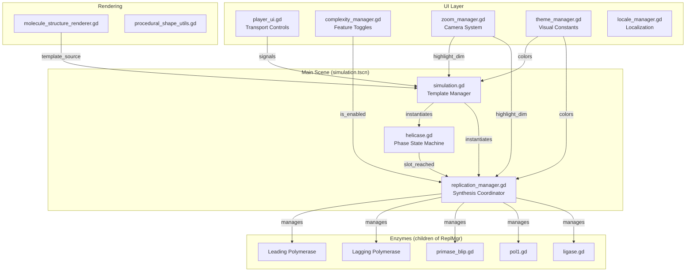
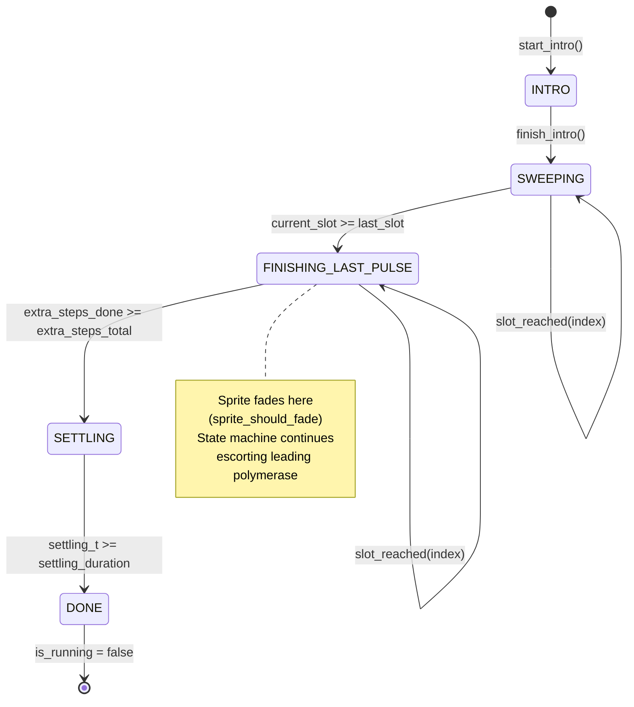
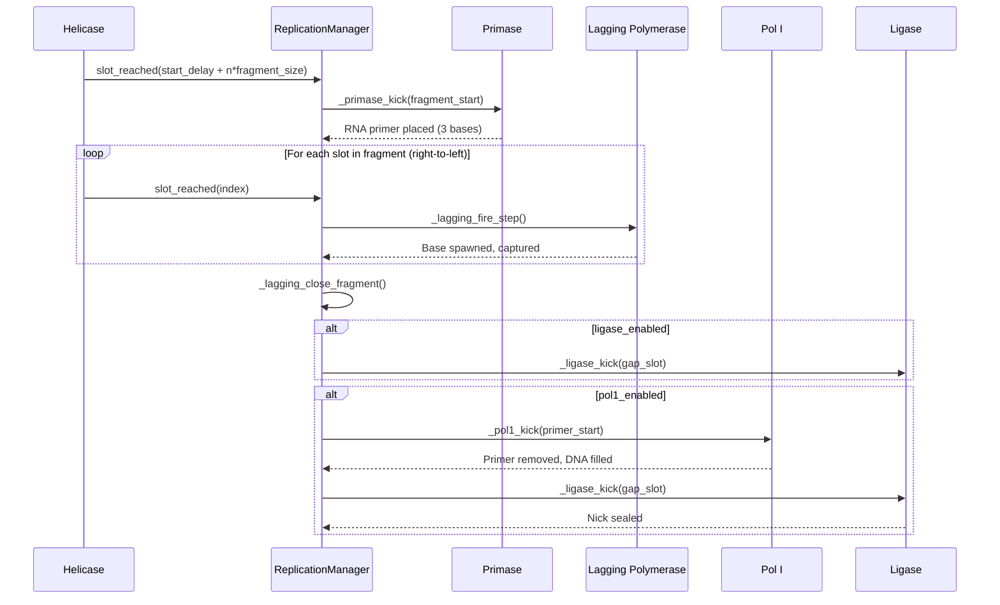
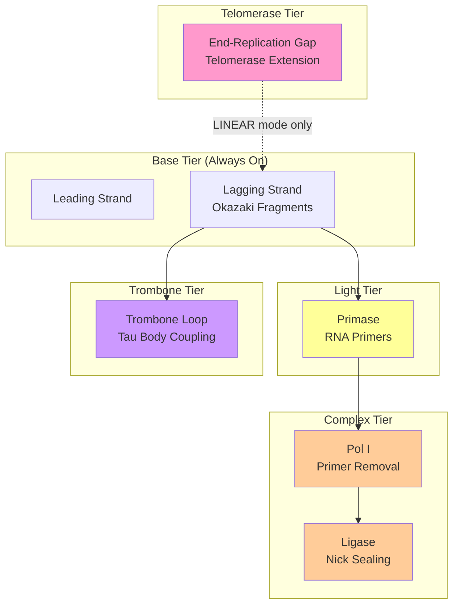
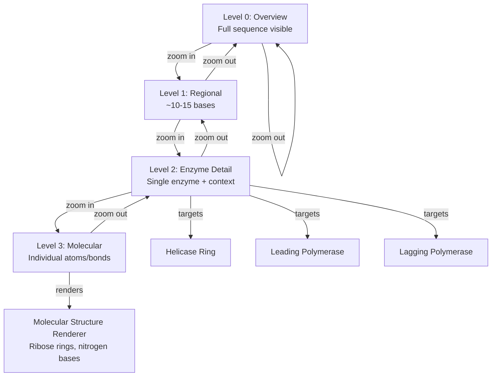
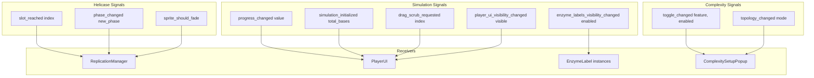

# Flowcharts & Diagrams


### 1. Overall System Architecture



### 2. Helicase Phase State Machine



### 3. Lagging Strand Okazaki Fragment Lifecycle



### 4. Independent End-of-Run Fade Cascade

```mermaid
graph LR
    A[Helicase reaches<br/>last_slot_index] --> B[Phase:<br/>FINISHING_LAST_PULSE]
    B --> C[emit sprite_should_fade]
    C --> D[Helicase sprite fades]
    
    D --> E[Helicase takes<br/>extra_steps_total<br/>invisible steps]
    E --> F[Leading polymerase<br/>reaches true end]
    F --> G[Leading polymerase fades]
    
    H[Lagging catchup<br/>completes] --> I[_lagging_finish_pending<br/>armed]
    I --> J{Position tween<br/>AND capture<br/>both finished?}
    J -->|No| K[Wait in update()]
    K --> J
    J -->|Yes| L[Lagging polymerase fades]
    
    M[Pol I queue drains] --> N[Pol I fades]
    O[Ligase queue drains] --> P[Ligase fades]
    
    G & L & N & P --> Q[All enzymes faded]
    Q --> R[scene_fully_faded = true]
    R --> S[is_fully_complete() returns true]
```

### 5. Complexity Toggle Dependencies



### 6. Zoom Level Hierarchy



### 7. Signal Communication Map



---

